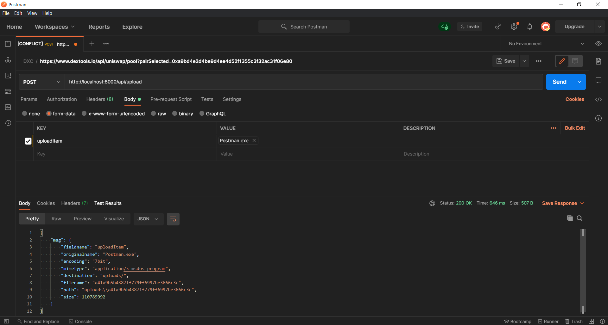

<h1>Simple Technique to upload file in Node.js.</h1>

In this repo, you'll learn how you can upload the file to Node.js server in the simplest way as much as possible. Happy Hacking!

<hr/>

**Clone the repo**🚀: <i>Note: You can start from scratch
too.</i>

1. Run on terminal
   `https://github.com/sangya2001/File-Upload-in-Node.js`
2. Get into the folder
   `npm i`

**Get started from Scratch**

1. Initialize the Empty Repo
   `mkdir file-upload && cd file-upload`

2. Initialize the Node.js setup: <i>Note: Make sure Node is installed on your system.</i>
   `npm init -y` or `npm init`

3. Create `index.js` & `app.js` or for MAC, Linux OS simply `touch index.js && touch app.js`

4. Install supporting packages
   `npm i express body-parser morgan multer`
   **Note: Optional**
   `npm i --save-dev nodemon`

5. Setup Server on `index.js`:

```
const http = require('http');
const PORT = process.env.PORT || 8000;

http.createServer(require('./app')).listen(PORT, (err) => {
    if (err) console.log(err);
    console.log(`Server Running => ${PORT}`)
})
```

Here, the `http` module has been used which is one of the built in function of Node.js. Environment file has been used to keep the best practices. Inside the error handling, arrow function from ES6, ES7 has been used.

6. Setup `app.js`

```
const express = require('express');
const morgan = require('morgan');
const bodyParser = require('body-parser');
const cors = require('cors');
const UploadRouter = require('./controller/upload')

const app = express();

app.use(cors())

app.use(morgan('dev'));

// parse application/x-www-form-urlencoded
app.use(bodyParser.urlencoded({ extended: false }))

// parse application/json
app.use(bodyParser.json())

app.use("/api", UploadRouter);

module.exports = app;
```

7. Initialize uploads and controller directory
   `mkdir uploads && mkdir controller`

8. Initialize `controller.js` in controller directory

```
const multer = require('multer');
const express = require('express');
const UploadRouter = express.Router();

// @dev uploads/ may not work on all OS (I'm using Windows 10 Home Edition) so you can use file path to navigate to the folder
const upload = multer({ dest: 'uploads/' });

// @dev uploadItem is a key for value(item), also if you want to upload multiple file then use upload.multiple()
UploadRouter.post('/upload', upload.single('uploadItem'), (req, res) => {
    res.json({ msg: req.file });
 });

module.exports = UploadRouter;
```

9. Run the server and test using PostmanAPI


<hr/>

<b>References:</b>
Node.js: <a href="https://nodejs.org">https://nodejs.org</a>
Express.js: <a href="https://expressjs.com/">https://expressjs.com/</a>
Postman API: <a href="https://www.postman.com/">https://www.postman.com/</a>

Made by <a href="https://github.com/codewithsudeep">CodewithSudeep.</a>